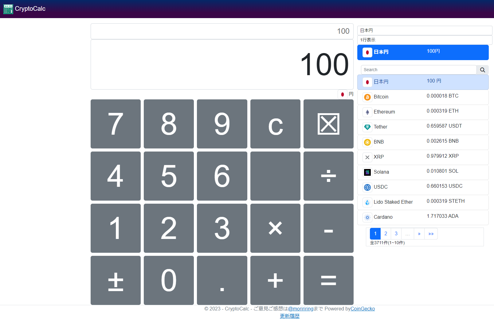

# [CryptoCalc](https://cryptocalc.azurewebsites.net/)

## CryptoCalcとは

- [CryptoCalc](https://cryptocalc.azurewebsites.net)は、仮想通貨に特価した電卓
- 電卓に入力した数字を仮想通貨のレートとして表示出来る
- レートは1日1回自動更新
- 対応している仮想通貨は3500種類以上
- 対応している法定通貨は40種類以上
